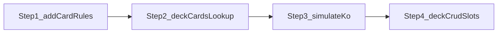

# Repetitive refactor — four steps (ship one at a time)

Each step is its own PR-sized change. **Do not start step N+1 until step N is shipped** (your workflow).

**Automated gates (every step, before manual check):**

- `npx eslint src --ext .ts --max-warnings 0` (for TS steps; add `public/js` paths if ESLint covers them and you touched those files)
- `npm run test:unit` (or `bash scripts/ship-conditional-test.sh unit` before ship)
- If the diff touches `src/index.ts`, `src/routes/`, or `src/api/http/`: `bash scripts/soc2-compliance-checks.sh`
- First push of day: `npm audit` per [.cursorrules](.cursorrules)

---

## Step 1 — Add-card rules ([`src/index.ts`](src/index.ts))

**Goal:** Replace duplicated `checkIfCardIs*` helpers and repeated loops in `validateCardAddition` with a small ordered rule list (same *idea* as [`src/services/deck-validation/`](src/services/deck-validation/), scoped to “can this card be added / count limits”).

**Manual check (sign-off):**

1. Log in locally, open **Deck Editor**, pick a deck with room to add cards.
2. **One-per-deck categories:** Try to add a *second* card that should be rejected for the same limit as today (exercise at least two of: Cataclysm, Assist, Ambush, Fortification — whichever your deck state allows). Confirm the **same user-visible error** as before (wording may be centralized; behavior must match).
3. **OPD / one-per-deck:** Add a card that is one-per-deck in DB; confirm you still cannot exceed one copy where the app already forbade it.
4. **Happy path:** Add a normal legal card and save; reload deck and confirm it persisted.

**Ship:** Commit + push only Step 1.

---

## Step 2 — Deck card existence + lookup ([`src/database/deck/deck-cards.ts`](src/database/deck/deck-cards.ts) + [`src/database/collection/card-lookup.ts`](src/database/collection/card-lookup.ts))

**Goal:** Remove the large `switch (cardType)` in `deck-cards.ts` by reusing or sharing the **`CARD_TABLE_BY_TYPE` / generated query** pattern already in `card-lookup.ts` (single source of truth for type → table → exists query).

**Manual check (sign-off):**

1. **Deck save:** Add or remove cards of **several types** (character, mission, power, special, at least one universe subtype you use) and **Save**; no 500s, cards stay after refresh.
2. **Deck list / open:** Open a few decks from **Deck Selection**; thumbnails and counts look unchanged.
3. **Invalid id (optional):** If you have a quick way to trigger “card not found” (e.g. stale id), confirm behavior is unchanged (error handling, not a silent success).

**Ship:** Commit + push only Step 2.

---

## Step 3 — Simulate KO dispatch ([`public/js/components/simulate-ko.js`](public/js/components/simulate-ko.js))

**Goal:** Collapse the **duplicated** large `switch (cardType)` blocks into one **registry** or shared `getKoFieldsForCardType(...)` so both code paths stay in sync.

**Manual check (sign-off):**

1. Open the **Simulate KO** flow in the app (same navigation you use today).
2. For **at least three different `cardType` values** that hit different branches today (e.g. character vs mission vs power vs one universe type), select a card and confirm **displayed stats / KO-relevant fields** match what you saw **before** the refactor (same numbers and labels).
3. Toggle between two card types that previously used different switch arms; no console errors.

**Note:** [`public/js/card-image-utils.js`](public/js/card-image-utils.js) stays **out of scope** for this four-step plan; it can be a follow-up ship.

**Ship:** Commit + push only Step 3.

---

## Step 4 — Deck CRUD slot mapping ([`src/database/deck/deck-crud.ts`](src/database/deck/deck-crud.ts))

**Goal:** Replace copy-pasted `character_1`…`character_4` / mission field blocks in `mapDeckRowToListDeck` (and any parallel mapping) with **slot descriptors** + loop or small shared mapper.

**Manual check (sign-off):**

1. **List decks:** Deck list shows correct **titles**, **character names/images** in slots, **mission** fields as before.
2. **Edit deck:** Change title or swap a character slot; save and reopen — **all four character slots** and missions still correct (no shifted or empty slots).
3. **API sanity (optional):** `GET` deck detail or list endpoint for a deck you know well; JSON slot fields match pre-refactor shape (field names unchanged for clients).

**Ship:** Commit + push only Step 4.

---

## Dependency order

Steps are **independent by layer** (server vs client) except that you chose sequential shipping for safety; Step 2 does not require Step 1 code-wise, but **keep your ship order 1 → 2 → 3 → 4** as requested.

---

## Docs / style guide

- **Step 1 or 4** if behavior or messages are user-visible: update [`docs/current/DECK_LEGALITY_RULES.md`](docs/current/DECK_LEGALITY_RULES.md) or related deck docs only if something contract-relevant changes.
- **Step 3:** If UI strings or layout change (they should not), update [`docs/current/STYLE_GUIDE.md`](docs/current/STYLE_GUIDE.md).
