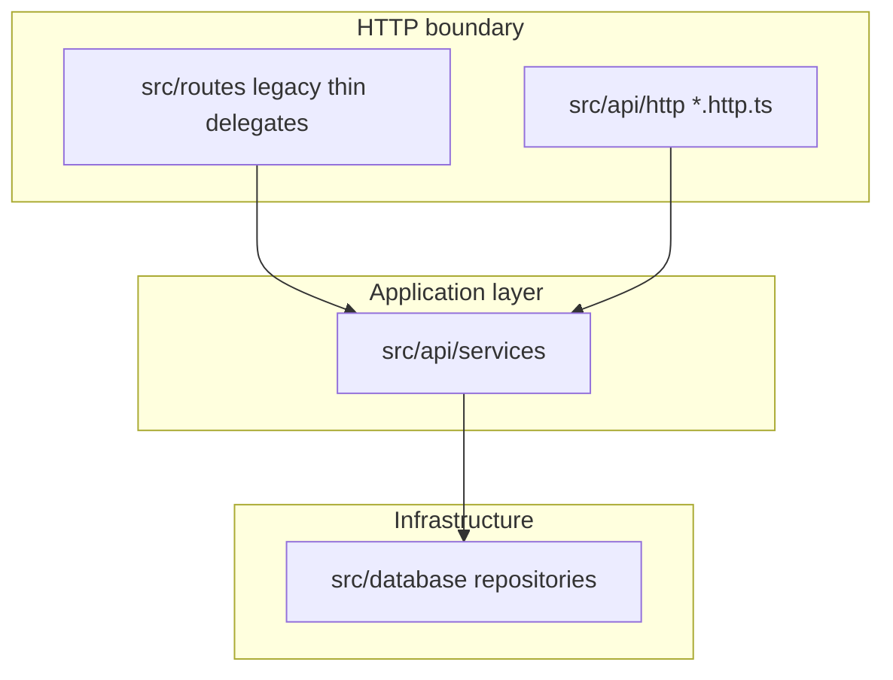

# API migration architecture (Excelsior)

Human-readable companion to [`src/api/.cursorrules`](src/api/.cursorrules). Describes how legacy routes and `/api/v1` share **services** while keeping HTTP adapters thin.

## Layer diagram

## Layering rules (summary)

| Layer | Responsibility | Forbidden |
|-------|----------------|-----------|
| **HTTP / `*.http.ts`** | Routing, validate → **request models**, call **one** service method, map to **response DTO** / v1 envelope | Business rules, direct DB calls, inline request/response type definitions |
| **Services** | Business logic, orchestration, domain authz | `req` / `res`, HTTP status codes inside core logic |
| **Repositories** | SQL / persistence | HTTP concepts |
| **Request models** | One file per body/query/param contract | Ad hoc `req.body` typing as source of truth in routes |
| **Response DTOs** | One file per public response shape | Anonymous-only responses in route files |

**Admin:** Operations requiring `ADMIN` or cross-tenant access **must** be registered only under **`/api/v1/admin/...`**. Non-`/admin` handlers **must not** call admin-privileged service entry points. No client-supplied `isAdmin` / `role` flags.

**Passwords:** v1 login issues JWT **after** existing `AuthenticationService` / repository password verification. **No** hashing algorithm changes, bcrypt cost changes, or password storage migrations in this program.

## Legacy `src/routes` vs persistence

- **Catalog (DBV lists + foil map):** **`/api/v1/catalog/*`** in **`dbv-catalog.http.ts`** uses **`CatalogService`** only; the service uses **`CardRepository`** + **`FoilCardMapRepository`**. Route modules do **not** take those repositories—**HTTP → service → repository**.
- **Deck background list** is **`GET /api/v1/dbv/deck-backgrounds`** in **`dbv-support.http.ts`**, using **`deckBackgroundService`** (session auth, same as removed legacy route).
- **General rule:** Express route handlers call **services** (application layer), not repositories or raw DB pools, except where a deliberate exception is documented.

## Route file grouping (`src/api/http/`)

1. **`auth.http.ts`** — `/auth/login`, `/auth/logout`, `/auth/me`, token behavior.
2. **`dbv-catalog.http.ts`** — Card catalog reads backing the Database View.
3. **`dbv-support.http.ts`** — DBV support reads (`GET /api/v1/dbv/sets`, **`GET /api/v1/dbv/deck-backgrounds`**).
4. **`decks.http.ts`** — User-scoped decks (**`GET /api/v1/decks`** list via **`DeckListService`**; session auth like **`GET /api/v1/dbv/deck-backgrounds`**).
5. **`collections.http.ts`**, **`guest-decks.http.ts`**, **`admin.http.ts`** — As migrations reach those domains.

Registration: `registerApiV1Routes(app, deps)` in [`src/api/http/registerApiV1Routes.ts`](src/api/http/registerApiV1Routes.ts).

## Documentation

- **Legacy:** [API_DOCUMENTATION.md](API_DOCUMENTATION.md)
- **v1:** [API_V1.md](API_V1.md) (sole place for `/api/v1` contract)
- **Checklist:** [API_MIGRATION_CHECKLIST.md](API_MIGRATION_CHECKLIST.md)

## Testing (mandatory)

- **Services + DTO mappers:** unit tests (`tests/unit/`).
- **Each `*.http.ts`:** full unit coverage (every route, success + key error branches, mocked deps).
- **Each `*.http.ts`:** ≥1 integration test (e.g. Supertest, real middleware + envelope).
- **Legacy + v1:** when both exist, integration tests should keep behavior aligned until cutover.

## JWT configuration

- **`JWT_SECRET`:** required when `NODE_ENV=production`; optional in development/test with a documented dev default (never use the default in production).
- **`JWT_EXPIRES_IN`:** optional (e.g. `2h`). Align TTL with product policy.
- **Production deploy:** store the secret in **AWS SSM Parameter Store** at **`/op-deckbuilder/dev/app/jwt_secret`** (type **SecureString**, region **us-west-2**). GitHub Actions **Run Production Migrations** runs [`.github/scripts/append-jwt-env.json`](.github/scripts/append-jwt-env.json) on the EC2 instance via SSM so **`JWT_SECRET=...`** is appended to **`/opt/app/.env`** before blue-green deploy. The EC2 instance role already has **`ssm:GetParameter`** on `parameter/op-deckbuilder/dev/*`. **`scripts/deploy-to-production.sh`** uses the same SSM path. Do not commit the secret. Full revival steps: [docs/current/DEPLOYMENT.md](docs/current/DEPLOYMENT.md) (SSM checklist and JWT section).

## Optional standalone API process

To run **only** the JSON API on another port, compose the same **`RegisterApiV1Deps`** as [`src/index.ts`](src/index.ts), create an `express()` app with `express.json()` (and any shared security middleware you need), then `app.use('/api/v1', createApiV1Router(deps))` and `listen(process.env.API_STANDALONE_PORT)`. **`createApiV1Router`** is exported from [`src/api/http/registerApiV1Routes.ts`](src/api/http/registerApiV1Routes.ts) alongside **`registerApiV1Routes`**. No default npm script is required; document the port in ops runbooks when used.
