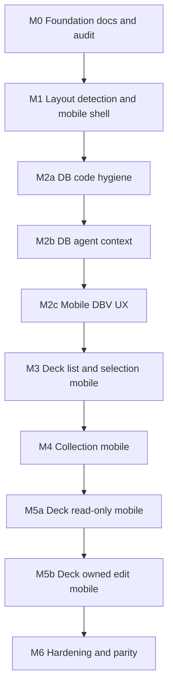

# Mobile design — findings, strategy, and roadmap

This document is the **source of truth** for mobile and dual–layout-mode work on Excelsior Deckbuilder. It complements [`docs/current/STYLE_GUIDE.md`](docs/current/STYLE_GUIDE.md) (visual specs) and repo [`.cursorrules`](.cursorrules).

---

## 1. Current architecture

- **Single HTML shell:** Express serves [`public/index.html`](public/index.html) for `/`, deck routes, collection, and `/data` via [`src/routes/pages.routes.ts`](src/routes/pages.routes.ts). No separate mobile HTML or server-side device routing.
- **Views:** One global CSS/JS bundle; views toggle with classes such as `view-removed`.
- **Global chrome:** [`public/components/globalNav.html`](public/components/globalNav.html) injected into `#globalNav` from [`public/js/app-initialization.js`](public/js/app-initialization.js).
- **Layout mode (implemented):** **Desktop** vs **mobile** layout mode is determined on the **client** using **`window.matchMedia`** and optional **user override** (`localStorage` key `preferDesktopLayout`). Root element classes: `layout-desktop` / `layout-mobile`. See [`public/js/layout-mode.js`](public/js/layout-mode.js).

---

## 2. Inventory (major CSS/UX surfaces)

| Area | Primary files | Desktop-oriented notes |
|------|---------------|-------------------------|
| App shell / deck editor | [`public/css/index.css`](public/css/index.css) | ~1400px container; two-pane flex; `overflow: hidden`; mixed z-index. |
| Card database | [`public/css/card-tables.css`](public/css/card-tables.css), [`public/css/database-view.css`](public/css/database-view.css) | Fixed tables, wide filters (e.g. missions filters `min-width`). |
| Collection | [`public/css/collection-view.css`](public/css/collection-view.css) | 1400px max-width; small checkboxes in places. |
| Deck selection | [`public/css/deck-selection.css`](public/css/deck-selection.css) | 44×44 menu pattern in places. |
| Global nav | [`public/components/globalNav.css`](public/components/globalNav.css) | Partial `@media` at 900px / 600px. |

---

## 3. Breakpoint audit

- **STYLE_GUIDE** documents Mobile `768px`, Tablet `900px`, Desktop `901px+`.
- **Codebase** historically used many thresholds (500, 600, 700, 768, 800, 900, 1000, 1200px) without a single token.
- **Canonical layout-mode breakpoint:** **`768px`** — aligned with STYLE_GUIDE; exposed as CSS variable **`--layout-mobile-max: 768px`** on `:root` in [`public/css/mobile-layout.css`](public/css/mobile-layout.css) and mirrored in `layout-mode.js` (`LAYOUT_MOBILE_MAX_PX`).

---

## 4. Why mobile felt poor (root causes)

1. Two-pane deck editor + mouse-style resizer on narrow viewports.
2. Data-dense tables and wide filter bars requiring horizontal scroll.
3. List view locked to **two columns** in JS ([`public/js/deck-editor-layout.js`](public/js/deck-editor-layout.js)).
4. Inconsistent touch targets vs STYLE_GUIDE **44px** minimum.
5. STYLE_GUIDE responsive bullets were partly **aspirational** relative to code (now called out in STYLE_GUIDE).

---

## 5. Dual-interface strategy (industry standard)

- **Not recommended as default:** server **User-Agent** routing (fragile; wrong for narrow desktop windows).
- **Implemented:** **`matchMedia('(max-width: 768px)')`** (+ optional `(pointer: coarse)` hint in JS), **`change`** listener on resize/orientation, root class **`layout-mobile`** / **`layout-desktop`**.
- **Override:** `localStorage.setItem('preferDesktopLayout','1')` forces desktop layout class even on narrow viewports; remove key to restore breakpoint behavior. (Product may add a “Desktop site” link later.)
- **FOUC mitigation:** Inline snippet in [`public/index.html`](public/index.html) `<head>` runs before main CSS to set initial layout class.
- **Styling:** [`public/css/mobile-layout.css`](public/css/mobile-layout.css) — rules scoped under **`.layout-mobile`** so desktop layout is unchanged.

---

## 6. Roadmap — milestones

| Milestone | What we deliver | Depends on | Done when |
|-----------|-----------------|------------|-----------|
| **M0** | Baseline docs, STYLE_GUIDE alignment, breakpoint audit in this file | — | This doc + STYLE_GUIDE updates landed |
| **M1** | `matchMedia` layout mode, shell hooks, `mobile-layout.css` | M0 | Narrow viewport gets `layout-mobile` + usable nav |
| **M2** (umbrella) | Card database mobile-first | M1 | M2a–M2c met |
| **M2a** | DB-scoped CSS/JS hygiene | M1 | DBV files cleaned; no desktop regressions |
| **M2b** | `.cursorrules` + agent context for DBV + mobile | M2a | Rules committed |
| **M2c** | Touch-first DBV browse/filter | M2b | Usable DB on phone without table-only UX |
| **M3** | Deck list / selection mobile | M2c | Deck tiles/menus usable |
| **M4** | Collection mobile | M3 | Collection usable |
| **M5** (umbrella) | Deck editor mobile | M4 | M5a + M5b met |
| **M5a** | Read-only deck viewing | M4 | Non-owner / readonly routes readable |
| **M5b** | Owned deck editing | M5a | Owner edit/save on mobile |
| **M6** | Tests, tablet policy, z-index pass | M5b | CI / docs |

### M2 sub-milestones

| Sub | Deliverable |
|-----|-------------|
| **M2a** | Hygiene in `card-tables.css`, `database-view.css`, touched DBV JS |
| **M2b** | [`public/css/.cursorrules`](public/css/.cursorrules), [`public/js/.cursorrules`](public/js/.cursorrules) DBV + `layout-mobile` notes |
| **M2c** | Mobile DBV UX (card rows, stacked filters, etc.) |

### M5 sub-milestones

| Sub | Deliverable |
|-----|-------------|
| **M5a** | Read-only / preview / non-owner deck views on narrow screens |
| **M5b** | Owner edit: stacked panes, single-column list, save |

---

## 7. Preliminary sub-milestones (incremental refactors)

Small, desktop-neutral PRs; check off below as completed.

### Refactor completion log

| Item | Milestone | Status |
|------|-----------|--------|
| Breakpoint / layout tokens (`--layout-mobile-max`) | M0 | done |
| Z-index / stacking map (doc + STYLE_GUIDE) | M0 | done |
| CSS hygiene global (orphan block removal in `index.css`) | M0 | done |
| Viewport / clamp helpers (`viewport-positioning.js`) | M0 | done |
| DRY entry HTML | M1 | n/a (single `index.html`) |
| Optional CSS load order split | M1 | deferred (profile first) |
| DB: separate data from table chrome | M2a–M2c | in progress via mobile CSS |
| Filter / toolbar extraction | M2c | deferred (larger refactor) |
| Touch-target utilities (`.touch-target-min`) | M2c | done (base utilities in `mobile-layout.css`) |
| Deck editor layout config (`DECK_LIST_COLUMNS_MOBILE`) | M5a–M5b | done |
| Agent context: `public/css`, `public/js`, `public/components`, `public/.cursorrules` (layout-mobile, MOBILE_DESIGN pointers) | M2b / shell | done |
| Jest `Window` merge fixes (`getCardImagePath`, `SimulateKO`, deck globals) | M6 | done |
| `index.html` head order regression (`layout-mode-and-viewport.test.ts`) | M6 | done |

**M0 — Foundation**

- Breakpoint tokens on `:root`; document here and STYLE_GUIDE.
- Z-index map documented (nav 9999, etc.).
- Global CSS hygiene outside DBV-only passes.
- Shared viewport clamp helper for modals/menus.

**M1 — Layout mode + shell**

- DRY HTML if a second shell is ever added.
- Optional deferred non-critical CSS on mobile (measure first).

**M2a**

- Extract row vs container boundaries when touching DBV files for hygiene.

**M2c**

- Filter/toolbar extraction for sheet UI.
- Touch-target utilities; roll forward through M3–M5b.

**M5a**

- Deck layout config: column count + pane mode from shared constants in `deck-editor-layout.js`.

---

## 8. Risks and open decisions

- **Tablet behavior:** width-only `matchMedia` may classify large phones vs small tablets; document product choice in future revision.
- **Resize thrash:** layout-mode uses `matchMedia` `change` events.
- **Read-only vs edit:** do not show misleading Save on M5a flows; match desktop auth.
- **Open:** “Desktop site” UX copy and placement; optional cookie mirror of `localStorage` override.

---

## 9. Links

- [`docs/current/STYLE_GUIDE.md`](docs/current/STYLE_GUIDE.md) — Responsive Design + Mobile layout mode section
- [`docs/current/PROJECT_LAYOUT.md`](docs/current/PROJECT_LAYOUT.md) — repo map
- [`docs/FRONTEND_SCRIPT_MANIFEST.md`](docs/FRONTEND_SCRIPT_MANIFEST.md) — script load order
