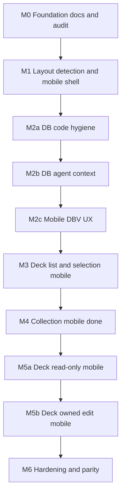

# Mobile design — findings, strategy, and roadmap

> ⚠️ **LEGACY (v1) DOCUMENT.** The production frontend is now the **v2 React SPA in `frontend/`**, which has its own responsive desktop/mobile layouts driven by `LayoutModeProvider` (900px) and `useHorizontalSwipe` — see [`docs/current/FRONTEND_V2.md`](docs/current/FRONTEND_V2.md) and [`STYLE_GUIDE_V2.md`](STYLE_GUIDE_V2.md). The architecture, milestones, and `layout-mobile`/`public/` patterns described below pertain to the **deprecated v1 `public/` UI**, retained for historical context and rollback only. Do not implement new mobile work from this doc; use the v2 feature/component docs under `frontend/src/`.

This document is the **source of truth** for mobile and dual–layout-mode work on the **legacy v1** Excelsior Deckbuilder UI. It complements `[docs/current/STYLE_GUIDE.md](docs/current/STYLE_GUIDE.md)` (v1 visual specs) and repo `[.cursorrules](.cursorrules)`.

## Quick Navigation — Mobile Docs Index

Use this table to jump directly to the right doc. All per-tab specs stay in `docs/current/`.

| Task / Topic | Go to |
|---|---|
| Mobile layout strategy, milestones, `layout-mobile` class, `isLayoutMobile()` | This file (sections below) |
| DBV Aspects tab mobile (filters, caption, art) | [`docs/current/DBV_ASPECTS_MOBILE.md`](docs/current/DBV_ASPECTS_MOBILE.md) |
| DBV Missions tab mobile (mission-set select, card rows) | [`docs/current/DBV_MISSIONS_MOBILE.md`](docs/current/DBV_MISSIONS_MOBILE.md) |
| DBV Training tab mobile (type toggles, card rows) | [`docs/current/DBV_TRAINING_MOBILE.md`](docs/current/DBV_TRAINING_MOBILE.md) |
| DBV Basic Universe tab mobile (type toggles + Teamwork strips) | [`docs/current/DBV_BASIC_UNIVERSE_MOBILE.md`](docs/current/DBV_BASIC_UNIVERSE_MOBILE.md) |
| Deck Editor View (DEV) in mobile — **legacy v1** (list, search, row actions) | [`docs/current/DECK_EDITOR_MOBILE_VIEW.md`](docs/current/DECK_EDITOR_MOBILE_VIEW.md) |
| Draw Hand — **v2** (header button, top slide-out, horizontal carousel in MV) | [`docs/current/DRAW_HAND_FEATURE.md`](docs/current/DRAW_HAND_FEATURE.md) · [`frontend/src/features/deck-editor/DeckEditorPage.md`](frontend/src/features/deck-editor/DeckEditorPage.md) |
| Collection tab mobile (list vs detail sheet, fixed sort) | [`docs/current/COLLECTION_VIEW_MOBILE.md`](docs/current/COLLECTION_VIEW_MOBILE.md) |
| Mobile DBV image sizing repeatable fix (`max-height: none !important`) | [`docs/current/MOBILE_DBV_TD_IMG_MAX_HEIGHT_FIX.md`](docs/current/MOBILE_DBV_TD_IMG_MAX_HEIGHT_FIX.md) |
| Mobile DBV row-art sizing history / experiments | [`docs/current/MOBILE_DBV_CARD_IMAGE_TRIES.md`](docs/current/MOBILE_DBV_CARD_IMAGE_TRIES.md) |
| DBV power-type icon filter strip (reusable component) | [`public/js/DBV_POWER_TYPE_FILTER_STRIP.md`](public/js/DBV_POWER_TYPE_FILTER_STRIP.md) |
| DBV card-name filter (reusable component) | [`public/js/DBV_CARD_NAME_FILTER.md`](public/js/DBV_CARD_NAME_FILTER.md) |
| DBV mission set `<select>` filter (Missions + Events) | [`public/js/DBV_MISSION_SET_FILTER.md`](public/js/DBV_MISSION_SET_FILTER.md) |

---

---

## 1. Current architecture (legacy v1 — superseded by the v2 SPA)

> The section below describes the **deprecated v1 `public/` shell**. In production, Express now serves the v2 React SPA (`frontend/dist/`) whenever it is built (`isSpaBuilt()`); the v1 shell is only served as a rollback (`EXCELSIOR_DISABLE_SPA=1`).

- **Single HTML shell:** Express serves `[public/index.html](public/index.html)` for `/`, deck routes, collection, and `/data` via `[src/routes/pages.routes.ts](src/routes/pages.routes.ts)`. No separate mobile HTML or server-side device routing.
- **Views:** One global CSS/JS bundle; views toggle with classes such as `view-removed`.
- **Global chrome:** `[public/components/globalNav.html](public/components/globalNav.html)` injected into `#globalNav` from `[public/js/app-initialization.js](public/js/app-initialization.js)`.
- **Layout mode (implemented):** **Desktop** vs **mobile** layout mode is determined on the **client** using `**window.matchMedia`** and optional **user override** (`localStorage` key `preferDesktopLayout`). Root element classes: `layout-desktop` / `layout-mobile`. See `[public/js/layout-mode.js](public/js/layout-mode.js)`. **Shell hooks:** `window.isLayoutMobile()`, `window.applyLayoutMode()`, `window.LAYOUT_MOBILE_MAX_PX`, `window.setPreferDesktopLayout`, and the document event `**layout-mode-change`** (used e.g. by `[deck-editor-layout.js](public/js/deck-editor-layout.js)` to reflow when the user resizes or toggles desktop preference).

---

## 2. Inventory (major CSS/UX surfaces)

| Area                    | Primary files                                                                                                                        | Desktop-oriented notes                                                                                                                                                                        |
| ----------------------- | ------------------------------------------------------------------------------------------------------------------------------------ | --------------------------------------------------------------------------------------------------------------------------------------------------------------------------------------------- |
| App shell / deck editor | `[public/css/index.css](public/css/index.css)`                                                                                       | ~1400px container; two-pane flex; `overflow: hidden`; mixed z-index.                                                                                                                          |
| Card database           | `[public/css/card-tables.css](public/css/card-tables.css)`, `[public/css/database-view.css](public/css/database-view.css)`           | Fixed tables, wide filters (e.g. missions filters `min-width`).                                                                                                                               |
| Collection              | `[public/css/collection-view.css](public/css/collection-view.css)`, `[public/js/collection-view.js](public/js/collection-view.js)`     | **DTV:** single wide table + column resize. **MV (`layout-mobile`):** **`#collection-mobile-list`** rows (thumb + title + **Type · # · Set** + qty); **fixed** list order = **`set_number` ascending** via **`sortMergedCollectionCards`** (module constants in JS — not tied to desktop thead sort); **no** in-panel list filter or sort controls; add-cards search is **`#collectionSearchInput`** only; bottom-sheet **`#collectionMobileDetail`**; **`layout-mode-change`** closes detail + re-renders. Agent spec: [`docs/current/COLLECTION_VIEW_MOBILE.md`](docs/current/COLLECTION_VIEW_MOBILE.md).                                                                                                                                                 |
| Deck selection          | `[public/css/deck-selection.css](public/css/deck-selection.css)`                                                                     | 44×44 menu pattern in places.                                                                                                                                                                 |
| Global nav              | `[public/components/globalNav.css](public/components/globalNav.css)`, `[public/css/mobile-layout.css](public/css/mobile-layout.css)` | `@media` at 900px / 600px; under `.layout-mobile`, **CSS grid** on `**unified-header**` (**`auto 1fr auto`**: logo | centered tabs | account icon); **`header-nav-cluster`** **`display: contents`**; **`.user-menu-toggle`** icon-only **`~44px`** — see **§10**. Desktop: **`header-nav-cluster`** **`display: contents`** (unchanged). |

---

## 3. Breakpoint audit

- **STYLE_GUIDE** documents legacy **Mobile** `768px` for some older `@media` rules; **client layout mode** uses `**900px`** so the stacked shell matches the former “tablet” band (see below).
- **Codebase** historically used many thresholds (500, 600, 700, 768, 800, 900, 1000, 1200px) without a single token.
- **Canonical layout-mode breakpoint:** `**900px`** — `layout-mobile` for `max-width: 900px`, `layout-desktop` for `901px+` (avoids a cramped desktop shell between 769–900). Exposed as `**--layout-mobile-max: 900px`** on `:root` in `[public/css/mobile-layout.css](public/css/mobile-layout.css)` and mirrored in `layout-mode.js` (`LAYOUT_MOBILE_MAX_PX`).

---

## 4. Why mobile felt poor (root causes)

1. Two-pane deck editor + mouse-style resizer on narrow viewports.
2. Data-dense tables and wide filter bars requiring horizontal scroll.
3. List view locked to **two columns** in JS (`[public/js/deck-editor-layout.js](public/js/deck-editor-layout.js)`).
4. Inconsistent touch targets vs STYLE_GUIDE **44px** minimum.
5. STYLE_GUIDE responsive bullets were partly **aspirational** relative to code (now called out in STYLE_GUIDE).

---

## 5. Dual-interface strategy (industry standard)

- **Not recommended as default:** server **User-Agent** routing (fragile; wrong for narrow desktop windows).
- **Implemented:** `**matchMedia('(max-width: 900px)')`**, `**change`** listener on resize/orientation (with resize fallback where needed), root class `**layout-mobile**` / `**layout-desktop**`. *(Width-only for now; `(pointer: coarse)` is not used in `[layout-mode.js](public/js/layout-mode.js)` but could augment detection later.)*
- **Override:** `localStorage.setItem('preferDesktopLayout','1')` forces desktop layout class even on narrow viewports; remove key to restore breakpoint behavior. `**window.setPreferDesktopLayout(true|false)`** in `[layout-mode.js](public/js/layout-mode.js)` updates storage and reapplies classes. (Product may add a “Desktop site” link later.)
- **FOUC mitigation:** A blocking `[layout-mode.js](public/js/layout-mode.js)` `<script>` in `[public/index.html](public/index.html)` `<head>` (before main CSS) runs `applyLayoutMode()` synchronously on load so `<html>` usually has the correct class before first paint.
- **Styling:** `[public/css/mobile-layout.css](public/css/mobile-layout.css)` — rules scoped under `**.layout-mobile`** so desktop layout is unchanged.

---

## 6. Roadmap — milestones

> **Superseded by the v2 SPA.** This roadmap (including **M5** deck-editor-mobile and later rows still marked `pending`) tracked the **legacy v1 `public/`** mobile effort. Mobile parity is now delivered by the v2 React SPA's responsive layouts in `frontend/src/` (deck editor: [`frontend/src/features/deck-editor/`](frontend/src/features/deck-editor/)). The pending rows below are **not** active work items.

| Milestone         | What we deliver                                                     | Depends on | Done when                                         | Status      |
| ----------------- | ------------------------------------------------------------------- | ---------- | ------------------------------------------------- | ----------- |
| **M0**            | Baseline docs, STYLE_GUIDE alignment, breakpoint audit in this file | —          | This doc + STYLE_GUIDE updates landed             | done        |
| **M1**            | `matchMedia` layout mode, shell hooks, `mobile-layout.css`          | M0         | Narrow viewport gets `layout-mobile` + usable nav | done        |
| **M2** (umbrella) | Card database mobile-first                                          | M1         | M2a–M2c met                                       | in progress |
| **M2a**           | DB-scoped CSS/JS hygiene                                            | M1         | DBV files cleaned; no desktop regressions         | done        |
| **M2b**           | `.cursorrules` + agent context for DBV + mobile                     | M2a        | Rules committed                                   | done        |
| **M2c**           | Touch-first DBV browse/filter                                       | M2b        | Every DBV tab usable on phone (see tab checklist) | in progress |
| **M3**            | Deck list / selection mobile                                        | M2c        | Deck tiles/menus usable                           | done        |
| **M4**            | Collection mobile                                                   | M3         | Collection usable                                 | done        |
| **M5** (umbrella) | Deck editor mobile                                                  | M4         | M5a + M5b met                                     | pending     |
| **M5a**           | Read-only deck viewing                                              | M4         | Non-owner / readonly routes readable              | pending     |
| **M5b**           | Owned deck editing                                                  | M5a        | Owner edit/save on mobile                         | pending     |
| **M6**            | Tests, tablet policy, z-index pass                                  | M5b        | CI / docs                                         | pending     |

Roadmap **Status** values are `**pending`**, `**in progress`**, or `**done**`. They track delivery of each milestone row above. The **Refactor completion log** in §7 tracks smaller incremental items and may show status per line independently.

### M3 — Deck list / selection mobile — **done**

**Pattern:** Hero-banner + full-width character strip + legality/⋯ in the upper-right corner.

- **Layout:** `.layout-mobile .deck-card.deck-tile.deck-tile--compact` switches from `grid-template-columns: 1fr 220px` to `display: flex; flex-direction: column`. **`.deck-tile-main`** fills the tile; **`.deck-tile-side`** is **`position: absolute`** (top-right) and only exposes **`.deck-tile-top-actions`** (badge + menu).
- **Gradient overlay:** The `::after` uniform dark overlay is replaced on mobile with `linear-gradient(to bottom, rgba(0,0,0,0.08) → rgba(0,0,0,0.80))` for text readability without obscuring the art.
- **Character grid (2×2):** `.deck-character-cards-row` switches from `display: flex` (clipped single row) to `display: grid; grid-template-columns: repeat(2, 1fr); gap: 8px;`. Each `.deck-character-card-display` cell sets `aspect-ratio: 380 / 280` (matches `PRESET_CHARACTER` thumbs) and `background-size: contain; background-position: center;` so the full card art is visible with no crop. Row height is `auto` and the tile grows vertically to accommodate two rows. Desktop `rotateY` tile/hover effects remain neutralized on MV (see `public/css/mobile-layout.css`).
- **Stats on MV:** **`.deck-tile-side-meta`** (Threat, Cards, dates) is **hidden** on MV. Date rows still carry `deck-tile-stat-date` in the DOM for DTV. Location/Mission previews are hidden on MV.
- **Ellipsis menu:** On MV, **`.deck-tile-menu`** is **visible** again: it sits in **`.deck-tile-top-actions`** with the legality badge to its **left** (far upper-right cluster). **`.deck-tile-side-meta`** (stats) stays hidden on MV. **View** / **Delete** / **Edit** are only in the dropdown (`stopPropagation` on `.deck-tile-side` keeps menu taps off the tile’s `editDeck` handler).
- **Tile tap:** `handleDeckTileClick` → **`editDeck(deckId)`** (same as DTV). No bottom action bar — tile height stays tight.
- **Files:** `public/css/mobile-layout.css`, `public/css/deck-selection.css`, `public/js/deck-selection/deckTilesRenderer.js`, `public/js/deck-selection/deckTileMobileInteraction.js`, `public/index.html` (script include).
- **Tests:** `tests/unit/deck-selection/deck-selection-modules.test.ts` — 9 tests, all pass.

### M2 sub-milestones

| Sub     | Deliverable                                                                                                                          |
| ------- | ------------------------------------------------------------------------------------------------------------------------------------ |
| **M2a** | Hygiene in `card-tables.css`, `database-view.css`, touched DBV JS                                                                    |
| **M2b** | `[public/css/.cursorrules](public/css/.cursorrules)`, `[public/js/.cursorrules](public/js/.cursorrules)` DBV + `layout-mobile` notes |
| **M2c** | Mobile DBV UX (card rows, stacked filters, etc.)                                                                                     |

#### M2c — database view tabs (mobile UX)

Per-tab delivery for the Card Database (`#database-view`). **Status** values: `pending`, `in progress`, `done` (same as the roadmap table above).

| Tab (UI label)         | `data-tab` / container id                     | Status  |
| ---------------------- | --------------------------------------------- | ------- |
| **All**                | `all-cards` / `all-cards-tab`                 | done    |
| **Characters**         | `characters` / `characters-tab`               | done    |
| **Special Cards**      | `special-cards` / `special-cards-tab`         | done    |
| **Universe: Advanced** | `advanced-universe` / `advanced-universe-tab` | pending |
| **Locations**          | `locations` / `locations-tab`                 | done    |
| **Aspects**            | `aspects` / `aspects-tab`                     | done    |
| **Missions**           | `missions` / `missions-tab`                   | **done** — see **§10.6** and [`docs/current/DBV_MISSIONS_MOBILE.md`](docs/current/DBV_MISSIONS_MOBILE.md) |
| **Events**             | `events` / `events-tab`                       | done    |
| **Universe: Teamwork** | `teamwork` / `teamwork-tab`                   | pending |
| **Universe: Ally**     | `ally-universe` / `ally-universe-tab`         | pending |
| **Universe: Training** | `training` / `training-tab`                   | done (see `docs/current/DBV_TRAINING_MOBILE.md`) |
| **Universe: Basic**    | `basic-universe` / `basic-universe-tab`       | done — [`docs/current/DBV_BASIC_UNIVERSE_MOBILE.md`](docs/current/DBV_BASIC_UNIVERSE_MOBILE.md) |
| **Power Cards**        | `power-cards` / `power-cards-tab`             | pending |

### M5 sub-milestones

| Sub     | Deliverable                                                  |
| ------- | ------------------------------------------------------------ |
| **M5a** | Read-only / preview / non-owner deck views on narrow screens |
| **M5b** | Owner edit: stacked panes, single-column list, save          |

**Implementation reference (DEV in `layout-mobile`):** [`docs/current/DECK_EDITOR_MOBILE_VIEW.md`](docs/current/DECK_EDITOR_MOBILE_VIEW.md) — single-column categorized list, **−**/**+**/⋯ row actions, hamburger-style card menu flyout, `deckEditorCardHasAlternateArts` parity, `refreshDeckEditorLayoutMode` / `layout-mode-change`, and file map.

---

## 7. Preliminary sub-milestones (incremental refactors)

Small, desktop-neutral PRs; check off below as completed.

### Refactor completion log

| Item                                                                                                                                    | Milestone   | Status                                            |
| --------------------------------------------------------------------------------------------------------------------------------------- | ----------- | ------------------------------------------------- |
| Breakpoint / layout tokens (`--layout-mobile-max`)                                                                                      | M0          | done                                              |
| Z-index / stacking map (doc + STYLE_GUIDE)                                                                                              | M0          | done                                              |
| CSS hygiene global (orphan block removal in `index.css`)                                                                                | M0          | done                                              |
| Viewport / clamp helpers (`viewport-positioning.js`)                                                                                    | M0          | done                                              |
| DRY entry HTML                                                                                                                          | M1          | n/a (single `index.html`)                         |
| Optional CSS load order split                                                                                                           | M1          | deferred (profile first)                          |
| Global nav stacked shell under `.layout-mobile` (flow layout, 44px targets)                                                             | M1          | done                                              |
| DB: separate data from table chrome                                                                                                     | M2a–M2c     | done (M2a: DB tables vs deck Card View CSS split) |
| Filter / toolbar extraction                                                                                                             | M2c         | deferred (larger refactor)                        |
| Touch-target utilities (`.touch-target-min`)                                                                                            | M2c         | done (base utilities in `mobile-layout.css`)      |
| DBV M2c: stacked filters, 44px targets, missions/special relax, Characters **card rows** (`data-label`, `card-display.js`)              | M2c         | done                                              |
| Deck editor layout config (`DECK_LIST_COLUMNS_MOBILE`)                                                                                  | M5a–M5b     | done                                              |
| Agent context: `public/css`, `public/js`, `public/components`, `public/.cursorrules` (layout-mobile, MOBILE_DESIGN pointers)            | M2b / shell | done                                              |
| Jest `Window` merge fixes (`getCardImagePath`, `SimulateKO`, deck globals)                                                              | M6          | done                                              |
| `index.html` head order regression (`layout-mode-and-viewport.test.ts`)                                                                 | M6          | done                                              |
| Global nav mobile: **grid** shell (**`auto 1fr auto`**), **`header-nav-cluster`** **`display: contents`**, `**syncHeaderCollectionLayout**` / `**collection-tab-hidden**`           | M1          | done                                              |
| Global nav mobile: logo **`max-width: 105px`** / **`max-height: 52px`**, tab row **`font-size: 12px`**, **`min-height: 35px`**, **`.app-tabs`** **`padding-inline: 5%`**, labels **`inline-flex`** centered in chip                             | M1          | done                                              |
| Global nav mobile: welcome **`.user-greeting`** stacked (MV); **`justify-content: flex-end`**; account dropdown **`max-content`** + viewport-capped width, `**right: 0**`                              | M1          | done                                              |
| DBV **All** tab: remove inline **5-col** grid on `**#all-cards-grid-container`**; single column ≤900px + `**.layout-mobile**`           | M2c         | done                                              |
| DBV **All** tab cells: **+Deck** row then **-Collection | +Collection** (`mobile-layout.css` grid on `**.card-content-bottom`**)        | M2c         | done                                              |
| DBV Characters: **tabbed stat filters** (merged `colspan=5` header cell, `characters-stat-filter-tabs.js`)                              | M2c         | done                                              |
| DBV **Aspects** tab (mobile filter shell, value/no-value chrome, caption, actions grid; no pseudo **Actions** label)                  | M2c         | done                                              |
| DBV **Missions** tab (mobile mission-set `<select>`, vertical card rows, caption, search ∩ set filter)                                | M2c         | done                                              |
| DBV **Events** tab (mobile mission-set `<select>`, game effect filter, Locations-style card rows, caption: name / set / effect / flavor) | M2c         | done                                              |

**M0 — Foundation**

- Breakpoint tokens on `:root`; document here and STYLE_GUIDE.
- Z-index map documented (nav 9999, etc.).
- Global CSS hygiene outside DBV-only passes.
- Shared viewport clamp helper for modals/menus.

**M1 — Layout mode + shell** (complete)

- `layout-mode.js` + `mobile-layout.css` linked from `[public/index.html](public/index.html)`; narrow viewports get `layout-mobile` and a **mobile global header** (grid: logo | centered tabs | welcome — **§10**; rules in `mobile-layout.css` global nav block).
- **Verification:** `[tests/unit/layout-mode-and-viewport.test.ts](tests/unit/layout-mode-and-viewport.test.ts)` (automated); manual steps in `[docs/current/TESTING_GUIDE.md](docs/current/TESTING_GUIDE.md)` § *Mobile milestone M1*.
- DRY HTML if a second shell is ever added.
- Optional deferred non-critical CSS on mobile (measure first).

**M2a**

- Extract row vs container boundaries when touching DBV files for hygiene.

**M2c** (in progress — tab checklist under **M2c — database view tabs** above)

- Filter/toolbar extraction for sheet UI — **still deferred** (see refactor log).
- **Shipped so far:** `mobile-layout.css` DBV shell, tab chrome, touch targets, fluid wide filters, missions/special min-width relax; **All** tab grid and per-cell actions (see §10.2). **Characters** tab: **card-row** layout with `data-label` on most tbody cells (not the actions column); **name/stat `td` cells hidden on mobile** (`tbody td:nth-child(n+3)`); **caption** under the image on mobile (`characters-mobile-card-caption`: name, optional inherent ability, set/number); **actions** cell uses the same **+Deck** / **-Collection  +Collection** grid as **All**; height-lock coordination in `card-display.js` (`isLayoutMobile`, `layout-mode-change`). **Characters stat filters:** five stat filter columns merged into one `**th` (`colspan=5`)** with **icon tabs** (`.characters-stat-tablist` / `.characters-stat-tab`) and a single visible `**.characters-stat-panel.is-active`** on `.layout-mobile`; desktop shows all five `.column-filters` groups in one row (`database-view.css`). `**characters-stat-filter-tabs.js**` handles tab clicks and `layout-mode-change`. **Semantics:** unchanged — `=` exact value; Min/Max inclusive range; `applyFilters` in `card-filter-toggles.js` ANDs active constraints per `data-column`. **Aspects** tab (M2c checklist **done**): Special-style mobile filters minus function toggles, **Clear filters** on the icon row, **`displayAspects`** list rows + caption — see **§10.5**. **Missions** tab (M2c checklist **done**): mobile mission-set **`<select>`** (All + sets from data), **no** tab-level Clear; vertical card rows + caption; **`applyMissionFilters`** / **`populateMissionsMissionSetSelect`** — see **§10.6** and [`docs/current/DBV_MISSIONS_MOBILE.md`](docs/current/DBV_MISSIONS_MOBILE.md).
- **Special Cards tab (`.layout-mobile`):** `**thead`** is `**display: block; width: 100%**`; `**tr.special-cards-filter-row**` is `**display: flex; flex-direction: row; flex-wrap: wrap**` with `**justify-content: center**` (Characters-like border, **12px** radius). **Row 1 (full width, centered):** **function** icon toggles only (`**th.special-filter-function-th**`, `**order: 1**`). **Row 2 (full width, centered):** **power/type** icons + **No Icon** (`**th.special-filter-icon-th`**, `**order: 2**`); `**.special-function-filter-toggles**` / `**.special-power-filter-toggles**` use `**justify-content: center**`. **Full-width** filter `**th`** (**character**, **name**, **effect**, **value**) use `**flex: 1 1 100%`** plus `**width: 100% !important**` / `**max-width: 100% !important**` so they override `**database-view.css**` `**#special-cards-table th:nth-child(n) { width: … !important }**` (without this, stacked filters collapse into a narrow left rail). **Visual order** (flex `**order`**, DOM unchanged): **value** row (`**= / Min / Max`**, **No value** ban — `**special-value-inputs-and-clear`** **column** flex, **no** horizontal **padding** so edges match `**.header-filter`**; `**.column-filters**` **grid** `**4fr 85fr 4fr 125fr 4fr 125fr 4fr 45fr 4fr`** = **1%** buffers, **21.25 / 31.25 / 31.25 / 11.25%** filters (5% reclaimed from halving gutters split across four controls), items in cols **2 / 4 / 6 / 8**) → **character** search → **card name** search → **card text** search. `**thead tr:first-child`** labels **visually hidden**; `**#clear-special-filters-desktop`** hidden on mobile (no MV inline Clear on Special). **Tbody** matches Characters (card rows, hidden cols 3+, captions, height locks). Embedded DBV may differ — parity targets `**[public/index.html](public/index.html)**`.
- **Verification:** [docs/current/TESTING_GUIDE.md](docs/current/TESTING_GUIDE.md) § *Mobile milestone M2c (Card Database / DBV)*.

**M5a**

- Deck layout config: column count + pane mode from shared constants in `deck-editor-layout.js`.

---

## 8. Risks and open decisions

- **Tablet / narrow window behavior:** `layout-mobile` applies up to **900px** so the stacked shell covers small tablets and the 769–900px band where the desktop header overlapped DB controls; large phones vs small tablets may still feel similar—optional future `(pointer: coarse)` augmentation noted in §5.
- **Resize thrash:** layout-mode uses `matchMedia` `change` events.
- **Read-only vs edit:** do not show misleading Save on M5a flows; match desktop auth.
- **Open:** “Desktop site” UX copy and placement; optional cookie mirror of `localStorage` override.

---

## 9. Links

- `[docs/current/STYLE_GUIDE.md](docs/current/STYLE_GUIDE.md)` — Responsive Design + Mobile layout mode section
- `[docs/current/PROJECT_LAYOUT.md](docs/current/PROJECT_LAYOUT.md)` — repo map
- `[docs/FRONTEND_SCRIPT_MANIFEST.md](docs/FRONTEND_SCRIPT_MANIFEST.md)` — script load order

---

## 10. Recent implementation notes (global nav + DBV All tab)

Use this section as **agent context** for what shipped after the base M1/M2c milestones. Primary code: `[public/components/globalNav.html](public/components/globalNav.html)`, `[public/components/globalNav.js](public/components/globalNav.js)`, `[public/css/mobile-layout.css](public/css/mobile-layout.css)`, `[public/js/all-cards-display.js](public/js/all-cards-display.js)`, `[public/index.html](public/index.html)`.

### 10.1 Global header under `.layout-mobile`

- **Structure:** `**[header-nav-cluster](public/components/globalNav.html)`** wraps `**.header-center**` (view tabs only) and `**.header-right**` (`**#newDeckBtn**` + user menu + legacy dropdown hooks). **Desktop:** `**[.header-nav-cluster](public/components/globalNav.css)`** uses `**display: contents**` so the bar is logo | centered tabs | `**.header-right**` (**+ Deck** left of welcome). **MV:** `**mobile-layout.css**` also sets **`header-nav-cluster`** to **`display: contents`** so **`unified-header`** grid can place **`.header-left`** / **`.header-center`** / **`.header-right`** in three columns.
- **Single-row header (grid):** Under `**.layout-mobile**`, `**mobile-layout.css**` sets `**.unified-header**` to `**display: grid**`, `**grid-template-columns: auto 1fr auto**`, `**column-gap: 6px**`, `**min-height: 56px**`, `**padding: 6px 8px**`, `**text-align: start**`. `**.header-nav-cluster**` uses `**display: contents**` so `**.header-left**`, `**.header-center**`, and `**.header-right**` are **direct grid children** (columns **1 / 2 / 3**). `**.header-center**` is **flex** `**justify-content: center**` so the tab strip is centered in the **1fr** column. View tabs live in `**.app-tabs**` (`**gap: 6px**`, **`padding-inline: 2%`**); `**.app-tab-button**` uses `**flex: 1 1 0**`, `**min-height: 35px**`, `**padding: 6px 8px**`, `**font-size: 12px**`, `**display: inline-flex**`, `**align-items: center**`, `**justify-content: center**` for label centering. Visible labels: **Database** / **Decks** / **Collection**. `**#newDeckBtn**` is `**display: none**` (use user menu **+ Create Deck**).
- **Logged out / no `getCurrentUser`:** `**[syncHeaderCollectionLayout()](public/components/globalNav.js)`** hides Collection and adds `**.collection-tab-hidden**` on `**.header-nav-cluster**`; **Database** keeps `**flex: 1 1 0**`, **Deck Builder** uses `**flex: 2 1 0**` (wider). Called from `**updateUserWelcome()`** after greeting/menu updates.
- **Logo:** `**.header-left**` `**max-width: 105px**`, left-aligned; `**.header-logo**` `**max-height: 52px**`, `**object-fit: contain**`; `**margin-top: 0**`.
- **Account control (bar):** **`#userMenuToggle`** is **icon-only** — **CSS hamburger** (**`.user-menu-hamburger`** + three **`.user-menu-hamburger-line`** bars; animates to an **X** when **`.open`**), **`aria-label="Account menu"`** — so the center column has more width for tabs. **`#userMenu`** has **no** tight **`max-width`** cap.
- **Account dropdown:** **Welcome, {name}!** is **right-aligned** in **`.user-menu-dropdown-header`**; **`#userMenuDropdownItems`** is **`display: grid`**, **`grid-template-columns: 1fr`** so all **`.user-menu-item`** rows share one **equal width** (the widest label). Default **`display: none`**; **`show`** toggles open. Under **`.layout-mobile`**, **`.user-menu-dropdown`** uses **`width: max-content`**, **`max-width: min(260px, calc(100vw - 16px))`**; **`.show`** uses **`display: flex`**, **`flex-direction: column`**, **`align-items: stretch`**, **`right: 0`**; **`.user-menu-item`** **`width: 100%`**, **`white-space: nowrap`**, compact padding. **`#currentUsername`** in the header uses **ellipsis** when long.

### 10.2 Card Database — “All” tab (`.layout-mobile` and narrow viewport)

- `**#all-cards-grid-container**` must **not** use an inline `**grid-template-columns: repeat(5, …)`** (removed from `[public/index.html](public/index.html)`); column count comes from `**[database-view.css](public/css/database-view.css)**` (`@media (max-width: 900px)` → single column) and `**mobile-layout.css**` under `**.layout-mobile**`.
- **Per-cell actions:** Under `**.layout-mobile #database-view #all-cards-grid-container .all-cards-cell .card-content-bottom`**, CSS grid places **+Deck** full width, then **-Collection** (left) and **+Collection** (right) on the next row (DOM order differs; explicit grid placement). Comment anchor in `**mobile-layout.css`**: `All tab cell actions`.
- **Characters tab row actions:** Under `**.layout-mobile #characters-table tbody td:nth-child(2)`**, the same grid pattern (**+Deck** full width; **-Collection** left, **+Collection** right). The actions `**td`** has **no** `**data-label`** so mobile does not show a **Deck & collection** pseudo label (`displayCharacters` in `**public/js/card-display.js`**).
- **Characters tab stats on mobile:** `**tbody td:nth-child(n+3)`** (**name** through **inherent abilities**) use `**display: none`** under `**.layout-mobile**` — card rows are **image + actions** only; filters still run against hidden cells.
- **All + Characters tile art (`.layout-mobile`):** Desktop **All** tab keeps `**max-width: 200px`** in `**database-view.css**`. Under `**.layout-mobile**`, `**mobile-layout.css**` sets `**#database-view**` custom properties `**--dbv-mobile-tile-img-max**` (`min(100%, calc(100vw - 28px))`) and `**--dbv-mobile-tile-img-landscape-max-h**` (`min(56vw, 480px)`). **All tab** `**#all-cards-grid-container`**: `**.all-cards-img-wrap**` and `**.all-cards-cell img**` use `**--dbv-mobile-tile-img-max**`; `**img.horizontal-card**` uses `**width: 100%**` and `**max-height: none**` so landscape tiles match portrait width (the landscape `**max-height**` token is for **Characters** / table rows, not the All grid). **Characters** tbody landscape art still uses `**max-height: var(--dbv-mobile-tile-img-landscape-max-h)`** with the same `**--dbv-mobile-tile-img-max**` width cap.
- **Characters tab image size (mobile):** `**tbody td:first-child .card-image-container`**: `**display: flex**`, `**width: 100%**`, `**max-width: 100%**`, `**margin-inline: auto**` (**prev | img | next**). `**img`**: `**max-width: var(--dbv-mobile-tile-img-max)**`, `**flex: 0 1 auto**`, `**object-fit: contain**`. Landscape art adds `**horizontal-card**` (same rule as `**all-cards-display.js**`: `**naturalWidth > naturalHeight**`); scoped `**max-height: var(--dbv-mobile-tile-img-landscape-max-h)**`. `**applyDbvHorizontalCardClass**` in `**card-display.js**` on image `**load**` and after `**navigateCardImage**` `**src**` changes. Inline `**max-width: 520px**` still skipped when `**isLayoutMobile()**`; mobile inline styles omit `**width` / `max-width**` so CSS owns dimensions. Caption `**max-width**` still `**min(444px, 100%)**` for long set lines.
- **Characters tab caption (mobile):** `**characters-mobile-card-caption`** under the image (`**characterMobileCaptionLines**` in `**card-display.js**`): line 1 = full `**name**`; line 2 = `**special_abilities**` when non-empty (same as Inherent Abilities column), `**.characters-mobile-card-caption__ability**`; line 3 = `**translateSet(set)**` + `**set_number**` (not text from parentheses — those stay on line 1); `**navigateCardImage**` syncs all lines when changing art.

### 10.3 Card Database — “Special Cards” tab (`.layout-mobile`)

- **Critical image sizing fix:** `database-view.css` has `td img { max-height: 180px !important }` that caps ALL table images. Mobile portrait image rules must include `max-height: none !important` to override this. **Repeatable fix pattern for all DBV tabs:** `[docs/current/MOBILE_DBV_TD_IMG_MAX_HEIGHT_FIX.md](docs/current/MOBILE_DBV_TD_IMG_MAX_HEIGHT_FIX.md)`.
- **Prerequisite:** List art, hover, and lightbox scaling under this section apply only when `**<html>`** has `**layout-mobile**`. `**preferDesktopLayout**` (`localStorage` `**preferDesktopLayout=1**`) forces `**layout-desktop**` on narrow viewports, so `**displaySpecialCards**` keeps **120px** inline table art and **none** of the `**.layout-mobile #special-cards-table`** rules run — if “mobile Special” tweaks seem to do nothing, check this first (compare with **Characters** on the same device).
- **Markup:** `[public/index.html](public/index.html)` — `**tr.filter-row.special-cards-filter-row`**; `**th**` classes `**special-filter-***`; placeholders **Search character…** / **Search card name…** / **Search card text…**; desktop **Clear All Filters** is `**#clear-special-filters-desktop**` in `**th.special-filter-clear-th**` (hidden on MV); value column is `**column-filters**` only inside `**special-value-inputs-and-clear**`.
- **CSS:** `[public/css/mobile-layout.css](public/css/mobile-layout.css)` — **Special Cards tab**: block `**thead`**, flex filter `**tr**`, full-width `**th**` overrides vs `**database-view.css**` `**!important**` column widths, `**order**` for filter rows, value sheet, tbody card layout. **List art (~1.5× vs Characters):** `**#special-cards-table`** defines `**--dbv-mobile-special-portrait-img**` (`**min(100%, 870px)**` — avoids `**100vw**` clipping vs padded cells), `**--dbv-mobile-special-tile-img-max**`, `**--dbv-mobile-special-tile-img-landscape-max-h**`; portrait with nav uses `**flex: 1 1 0**` between arrows; tbody `**img**` rules use these instead of the shared `**--dbv-mobile-table-portrait-img***` / tile tokens where applicable. **Mobile caption** `**max-width`** `**min(666px, 100%)**`. `**@media (max-width: 900px)**` duplicates the **tbody / art / hover / lightbox** rules for `**#database-view #special-cards-table`** (and global hover/lightbox selectors) so **narrow viewports** still get large list art when `**layout-desktop`** (`**preferDesktopLayout**`). **Hover:** `**.layout-mobile .card-hover-modal[data-card-type='special']`** — tighter `**padding**`, larger `**max-width` / `max-height**` on `**.card-hover-image**` (and full-res layer). **Lightbox:** `**.layout-mobile #imageModal[data-open-context='special'] #modalImage`** — larger caps when `**openModal**` sets `**data-open-context**` from `**data-dbv-lightbox-context**` on the clicked `**img**`.
- **JS:** `[public/js/card-display.js](public/js/card-display.js)` — `**specialMobileCaption`**, `**buildSpecialMobileCaptionHtml**`, `**specialCardEffectPlainForMobileCaption**` (strips keyword tokens from the effect line; OPD/Cataclysm/Assist/Ambush use DB flags), `**clearSpecialRowHeightLocks**` / `**refreshSpecialTableHeightLocks**`, `**lockAllSpecialCardRowHeights**` and per-row locks gated by `**isLayoutMobileForCardDisplay()**`. `**isNarrowViewportDbvBand()**` (`**matchMedia('(max-width: 900px)')**`) is combined with `**isLayoutMobileForCardDisplay()**` for Special list inline styles and height locks so `**layout-desktop**` on a phone still omits **120px** width. Special list `**img`** includes `**data-dbv-lightbox-context="special"**` for the image modal. `**[public/js/modal-ui.js](public/js/modal-ui.js)**` `**openModal**` / `**closeModal**` set or clear `**#imageModal**` `**data-open-context**`. `**[public/js/card-hover-modal.js](public/js/card-hover-modal.js)**` `**positionModal**` uses a larger viewport-clamp box for `**special**` when `**isLayoutMobile()**` or the same **900px** breakpoint matches.

### 10.4 Tests and docs map

- **Confirmed fix + repeatable pattern:** `[docs/current/MOBILE_DBV_TD_IMG_MAX_HEIGHT_FIX.md](docs/current/MOBILE_DBV_TD_IMG_MAX_HEIGHT_FIX.md)` — `max-height: none !important` override checklist for every DBV tab. Apply when mobilizing any tab with card images in `<td>` elements.
- **What we tried (mobile DBV art + `#imageModal`):** `[docs/current/MOBILE_DBV_CARD_IMAGE_TRIES.md](docs/current/MOBILE_DBV_CARD_IMAGE_TRIES.md)` — CSS/JS approaches that shipped; why the UI can still look unchanged (layout mode, cache, list vs modal); pointers for the next fix. **§ Confirmed failed / ineffective (user QA)** records approaches that still showed tiny Special list art in real use (~Mar 2026).
- **DBV reusable filter UI (DOM factories, DTV + MV):** `[public/js/DBV_POWER_TYPE_FILTER_STRIP.md](public/js/DBV_POWER_TYPE_FILTER_STRIP.md)` — power-type icon toggles (`[data-dbv-power-strip]`). `[public/js/DBV_CARD_NAME_FILTER.md](public/js/DBV_CARD_NAME_FILTER.md)` — card/name text inputs (`[data-dbv-name-filter]`). Filter math stays in `search-filter-functions.js` / `filter-functions.js` / `card-filter-toggles.js`; [`template-loader.js`](public/js/template-loader.js) re-inits both after template inject.
- **Unit:** `[tests/unit/layout-mode-and-viewport.test.ts](tests/unit/layout-mode-and-viewport.test.ts)` — `layout-mode.js`, `**mobile-layout.css`**: global nav + DBV **All** strip (M1 describe), **DBV Characters tab**, **DBV Special Cards tab** (block `**thead`**, flex filter `**tr**`, `**width: 100% !important**` on filter `**th**`, `**order**` rows, value sheet, tbody cards); `**public/index.html**` asserts `**special-cards-filter-row**` and `**clear-special-filters-desktop**`. **Aspects** mobile DBV: [tests/unit/dbv-aspects-mobile.test.ts](tests/unit/dbv-aspects-mobile.test.ts) (CSS, `database-view.css`, markup, `displayAspects` source + JSDOM). **Missions** mobile DBV: [tests/unit/dbv-missions-mobile.test.ts](tests/unit/dbv-missions-mobile.test.ts) (see [docs/current/DBV_MISSIONS_MOBILE.md](docs/current/DBV_MISSIONS_MOBILE.md)). **Universe: Basic** mobile DBV: [tests/unit/dbv-basic-universe-mobile.test.ts](tests/unit/dbv-basic-universe-mobile.test.ts) (see [docs/current/DBV_BASIC_UNIVERSE_MOBILE.md](docs/current/DBV_BASIC_UNIVERSE_MOBILE.md)).
- **Integration:** `[tests/integration/global-nav-integration.test.ts](tests/integration/global-nav-integration.test.ts)` — served `**globalNav.html`** / `**.css**` include `**header-nav-cluster**`, `**header-app-actions**`.
- **Style spec:** `[docs/current/STYLE_GUIDE.md](docs/current/STYLE_GUIDE.md)` — *Mobile Adaptations* / *Mobile layout mode* (global nav + DBV bullets).
- **Manual QA:** `[docs/current/TESTING_GUIDE.md](docs/current/TESTING_GUIDE.md)` — § *Mobile milestone M1* and *M2c* (All, Characters, Special Cards, **Aspects**, **Missions**).

### 10.5 Card Database — “Aspects” tab (`.layout-mobile`) — **done**

**M2c tab checklist** (§6): **Aspects** = **done**.

- **How it looks (filters, caption, actions, desktop chrome):** [`docs/current/DBV_ASPECTS_MOBILE.md`](docs/current/DBV_ASPECTS_MOBILE.md). **Regression tests:** [`tests/unit/dbv-aspects-mobile.test.ts`](tests/unit/dbv-aspects-mobile.test.ts).
- **Filter shell:** Same pattern as **Special Cards** (`flex` **`tr.aspects-filter-row`**, teal border shell) but **no** function-icon row; **mobile `order`**: **`.aspect-filter-icon-row`** — power types + No Icon (flex-grow center strip) + **`#clear-aspects-filters-mobile`** in **`.aspect-icon-mobile-trailing`** (**`margin-left: auto`**, right-aligned) → value sheet only → location / name / card text **`header-filter`** rows. **`[public/css/mobile-layout.css](public/css/mobile-layout.css)`**, **`[public/css/database-view.css](public/css/database-view.css)`** (hide **`.aspect-icon-mobile-trailing`** on desktop).
- **List rows:** **`displayAspects`** in **`[public/js/card-display-functions.js](public/js/card-display-functions.js)`** — **`card-image-container`**, **`--dbv-mobile-aspects-*`** art tokens, under-image **`characters-mobile-card-caption`** with **name → location → effect (plain) → Fortification! → One Per Deck**; fort/OPD table columns hidden on mobile. Helpers from **`[public/js/card-display.js](public/js/card-display.js)`**: **`isLayoutMobileForCardDisplay`**, **`isNarrowViewportDbvBand`**, **`specialCardEffectPlainForMobileCaption`** (exported on **`window`**). **`@media (max-width: 900px)`** **`#database-view #aspects-table`** mirror for **`preferDesktopLayout`** on narrow viewports.

### 10.6 Card Database — “Missions” tab (`.layout-mobile`) — **done**

**M2c tab checklist** (§6): **Missions** = **done**.

- **How it looks (filters, caption, no Clear, DTV + MV mission-set `<select>`):** [`docs/current/DBV_MISSIONS_MOBILE.md`](docs/current/DBV_MISSIONS_MOBILE.md). **Regression tests:** [`tests/unit/dbv-missions-mobile.test.ts`](tests/unit/dbv-missions-mobile.test.ts).
- **Filter shell:** **`tr.missions-filter-row`** — teal border shell like Aspects; **MV** shows **`.missions-mobile-set-row`** + **`.missions-mobile-card-name-row`**. **DTV** shows the same **`.missions-mobile-set-row`** (**`#missions-mission-set-filter`**) in the Mission Set column; **`.missions-mobile-card-name-row`** hidden — card name uses **`#missions-header-card-name-filter`**. Filter row uses **`th.missions-filter-leading-th colspan="2"`** over Image + actions (do **not** use **`display: none`** on a lone **`th`** — it breaks column alignment; no Missions-tab Clear column).
- **List rows + caption:** **`displayMissions`** — **`missionUseMobileListArt()`**, **`data-dbv-lightbox-context="mission"`**, caption **name → `mission_set` → `dbvSetCaptionLineFromCard`**. **`loadMissions`** → **`populateMissionsMissionSetSelect`** + **`applyMissionFilters`** (search ∩ set filter). **`[public/js/search-filter-functions.js](public/js/search-filter-functions.js)`**, **`[public/js/card-data-display.js](public/js/card-data-display.js)`**, **`[public/js/card-display.js](public/js/card-display.js)`** (**`window.dbvSetCaptionLineFromCard`**).

### 10.7 Collection view (`layout-mobile`) — **done**

**M4:** **`collectionIsLayoutMobile()`** (`**window.isLayoutMobile()**`) chooses markup in **`displayCollectionCards`** — **DTV** unchanged (table + header sort + resize). **MV:** **`#collection-mobile-list`** of **`li.collection-mobile-row`** (grid: **56px** thumb, text, actions); row qty **`−`/`+`** **`calc(29px × 0.9)`** (~26px, 10% under prior 29px); detail sheet steppers **`calc(32px × 0.9)`** (~29px, 10% under prior 32px); subtitle **`Type · #… · Set`**. **GUEST sandbox:** **`details#guestSandboxBanner`** — muted SVG warning icon + collapsed one-line summary + chevron; expand for full copy + **Create an account** (DTV stays always-open flex row). **Search to add cards** is only **`#collectionSearchInput`** (**`CardSearchService`**); no duplicate filter inside the panel. **List order:** **`set_number` ascending** via **`sortMergedCollectionCards`** and **`COLLECTION_MOBILE_LIST_SORT_FIELD` / `COLLECTION_MOBILE_LIST_SORT_DIR`** in **`collection-view.js`**; **no** **`#collectionMobileListFilter`** or **`#collectionMobileSort`** in the DOM. **Detail:** **`#collectionMobileDetail`** appended under **`#collection-view`** — scrim + **`#collectionMobileDetailPanel`** ( **`role="dialog"`** ), **Back** / **Escape** / scrim close; **`openCollectionMobileDetail`** / **`closeCollectionMobileDetail`** on **`window`** for tests. **`#collection-view`** delegate **`onCollectionViewMobileActivate`**: tap **`.collection-mobile-row-main`** opens detail; **`closest('.collection-quantity-control')`** or **`button`** → no open. **`layout-mode-change`** → **`onCollectionLayoutModeChange`** closes detail, syncs guest banner, re-renders from **`mergedCollectionData`** when the tab is visible. **CSS:** **`html.layout-mobile`** rules in **`collection-view.css`** (list, **`z-index: 10000`** overlay). **Unit:** **`tests/unit/collection-view.test.ts`** (`**displayCollectionCards() mobile layout**`, **`sortMergedCollectionCards`**); **`eval`** load — see **`docs/current/COLLECTION_VIEW_MOBILE.md`** for coverage limits. **Full map:** [`docs/current/COLLECTION_VIEW_MOBILE.md`](docs/current/COLLECTION_VIEW_MOBILE.md).

### 10.8 Mobile fluid typography tokens (`html.layout-mobile`) — **done**

**Why:** Before this work, mobile font sizes were a sprawl of ~25–35 distinct values across 9+ CSS files mixing `rem`, fixed `px`, `em`, `calc()`, and a few ad-hoc `clamp()` rules. Uncapped `rem` blew up when the user raised OS text scaling (Android "Font size: Large/Largest", iOS Dynamic Type), and fixed `px` ignored both viewport width and OS/browser scaling (failing **WCAG 1.4.4** resize-text). Different devices rendered the same deck-editor header, DBV captions, and collection rows at visibly different sizes.

**Token scale (all defined on `html.layout-mobile` in [`public/css/mobile-layout.css`](public/css/mobile-layout.css)):**

All tokens are `clamp(MIN_rem, rem-based_preferred + vw, MAX_rem)` — fluid with viewport width, responsive to user text-zoom, and clamped on both ends so nothing gets too small or runs off the screen.

| Token | Clamp | Px range | Intended use |
| --- | --- | --- | --- |
| `--font-3xs` | `clamp(0.5625rem, 0.50rem + 0.20vw, 0.6875rem)` | ~9–11 | Tiny uppercase labels (stat labels, empty tile placeholder) |
| `--font-2xs` | `clamp(0.6875rem, 0.625rem + 0.20vw, 0.8125rem)` | ~11–13 | Chips, toggles, draw-training pill, qty buttons |
| `--font-xs`  | `clamp(0.75rem, 0.70rem + 0.25vw, 0.875rem)` | ~12–14 | Nav tabs, badges, meta row, subtitles, validation icon labels |
| `--font-sm`  | `clamp(0.8125rem, 0.75rem + 0.30vw, 0.9375rem)` | ~13–15 | Row names, body text, search inputs, menu items, detail lines |
| `--font-md`  | `clamp(0.9375rem, 0.85rem + 0.40vw, 1.0625rem)` | ~15–17 | Section headers, caption card name, tile stat value |
| `--font-lg`  | `clamp(1.0625rem, 0.95rem + 0.50vw, 1.25rem)` | ~17–20 | Collection subtitle, select controls, modal header h3 |
| `--font-xl`  | `clamp(1.20rem, 0.90rem + 1.20vw, 1.60rem)` | ~19–26 | Deck title, deck-tile title |
| `--font-2xl` | `clamp(1.50rem, 1.10rem + 1.80vw, 2.25rem)` | ~24–36 | Collection/login screen titles |
| `--icon-sm`  | `clamp(0.875rem, 0.80rem + 0.35vw, 1.00rem)` | ~14–16 | Small inline icons (collapse caret, validation icon) |
| `--icon-md`  | `clamp(1.125rem, 1.00rem + 0.60vw, 1.375rem)` | ~18–22 | `⋯` overflow, sandbox-banner warning, card-view category toggle |
| `--icon-lg`  | `clamp(1.375rem, 1.20rem + 0.80vw, 1.625rem)` | ~22–26 | `×` close (**legacy v1** draw-hand modal; v2 uses `SlideOutPanel` close in Draw Hand) |

**Application surfaces:**

- **Deck editor modal (DEV, legacy v1):** [`public/css/deck-editor-mobile.css`](public/css/deck-editor-mobile.css) — header title/meta, validation badge + icon, stats, search input, section headers, rows, row menu, utility actions, **legacy** draw-hand close + training pill, card-view buttons + category toggle/name + collapse icon. **v2 Draw Hand** styling: [`DrawHandPanel.css`](frontend/src/features/deck-editor/DrawHandPanel.css) — see [`DRAW_HAND_FEATURE.md`](docs/current/DRAW_HAND_FEATURE.md).
- **Global nav (mobile header):** [`public/css/mobile-layout.css`](public/css/mobile-layout.css) — `.app-tab-button`, `.new-deck-btn`, user menu, create-user form.
- **Deck selection tiles:** [`public/css/mobile-layout.css`](public/css/mobile-layout.css) — tile title (`--font-xl`), empty slot placeholder, side label/value, menu button (`--icon-md`), menu items.
- **DBV tabs:** unified caption ladder across All / Special / Aspects / Missions / Training / Basic Universe / Ally / Power / Teamwork / Events — see [`public/css/mobile-layout.css`](public/css/mobile-layout.css). All power-type filter labels, `td[data-label]::before`, and mission-set `<select>` use the tokens.
- **Collection view:** [`public/css/collection-view.css`](public/css/collection-view.css) — sandbox banner + copy, row title/subtitle, qty buttons, detail heading/lines/qty, plus mobile-scoped overrides for the shared `.collection-title` / `.collection-subtitle` / `.collection-search-input`.
- **Card-tables checkbox `!important` rule** for Basic Universe is overridden from [`public/css/mobile-layout.css`](public/css/mobile-layout.css) with its own `!important` to avoid touching the desktop `card-tables.css` rule.

**Rules for future mobile CSS:**

1. **Never** add a literal `font-size` on a `.layout-mobile` rule. Use a token from the scale above.
2. **Never** add a fixed `px` font size under `.layout-mobile`. `px` ignores OS accessibility scaling and fails WCAG 1.4.4.
3. If a shared (desktop) stylesheet sets a `font-size`, add a mobile-scoped override in [`public/css/mobile-layout.css`](public/css/mobile-layout.css) or the relevant mobile file (e.g. [`public/css/deck-editor-mobile.css`](public/css/deck-editor-mobile.css)), not in the shared file.
4. If you truly need a new size outside the existing tokens, add it to the scale in [`public/css/mobile-layout.css`](public/css/mobile-layout.css) using the same `clamp(MIN_rem, rem + vw, MAX_rem)` pattern and document it here.
5. Icon-sized controls (close, overflow, toggles rendered as glyphs) should use the `--icon-*` tokens, not the text tokens, so they track glyph metrics.

**Unit tests** that assert CSS `font-size` values expect the `var(--font-*)` syntax (see `tests/unit/dbv-*-mobile.test.ts`, `tests/unit/layout-mode-and-viewport.test.ts`). When adjusting a token, update the relevant regex in the test.

