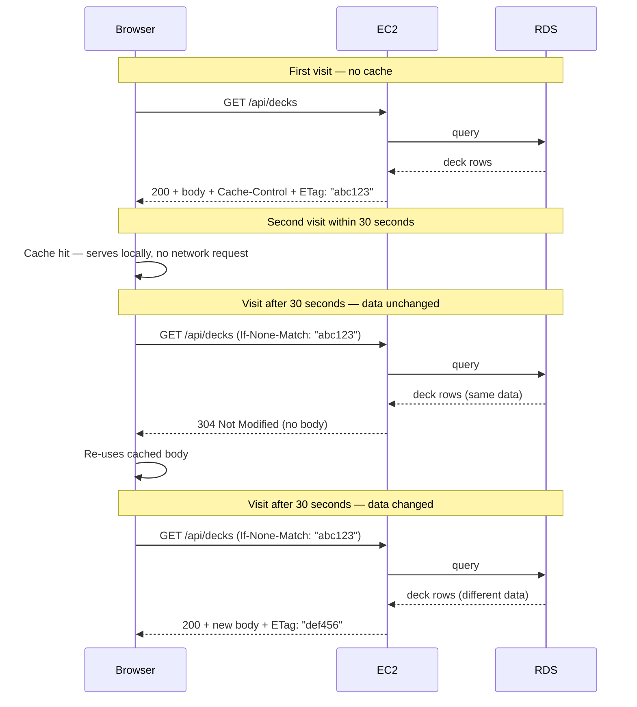

# HTTP Caching — GET /api/decks

## Overview

The deck list API response (`GET /api/decks`) uses two complementary HTTP caching headers to reduce unnecessary server load and eliminate redundant network transfers for repeat page visits.

**File:** `src/routes/decks.routes.ts`

---

## Headers

### `Vary: Cookie`

Tells the browser to include the session cookie value in the cache key. Without this, a guest auto-login session and a real user session share the same cached response for `GET /api/decks` — causing the guest's deck list to appear immediately after a real user logs in (within the 30-second window). With `Vary: Cookie`, each distinct session cookie gets its own cache entry.

### `Cache-Control: private, max-age=30`

Tells the browser it may store this response locally for up to **30 seconds**.

- `private` — cached only in the user's own browser. Never stored by a shared proxy or CDN. This is correct because each user's deck list is unique.
- `max-age=30` — within that 30-second window the browser serves the response from its own cache with **zero network round-trip** — the server is not contacted at all.

**Why 30 seconds:** Long enough to eliminate redundant loads from quick page revisits (navigating to the deck editor and back), short enough that a newly created deck is always visible within half a minute. Tune this value in `src/routes/decks.routes.ts`.

### `ETag: "<sha1-hash>"`

A SHA-1 fingerprint of the serialised response body, computed on every request.

After the 30-second `max-age` expires, the browser sends the stored ETag back in an `If-None-Match` request header. The server:
- Runs the database query and transforms the result as normal
- Computes the ETag of the new response
- Compares to the `If-None-Match` value
  - **Match:** returns `304 Not Modified` with **no body** — browser re-uses its local copy
  - **No match:** returns `200` with the new body and an updated ETag

This means a stale-check after 30 seconds costs one DB query but transmits **zero bytes** of JSON if the data has not changed.

---

## Request Flow

---

## Implementation Notes

- The ETag is computed with Node's built-in `crypto` module — no external dependency.
- The full response body is serialised to JSON once and reused for both the ETag hash and the response write, avoiding double-serialisation.
- Cache invalidation is automatic: any change to the user's deck list produces a different ETag on the next request.
- This cache is **per-user** (the `private` directive) and complements the server-side in-memory cache in `PostgreSQLDeckRepository` (2-minute TTL). The two layers work independently.
