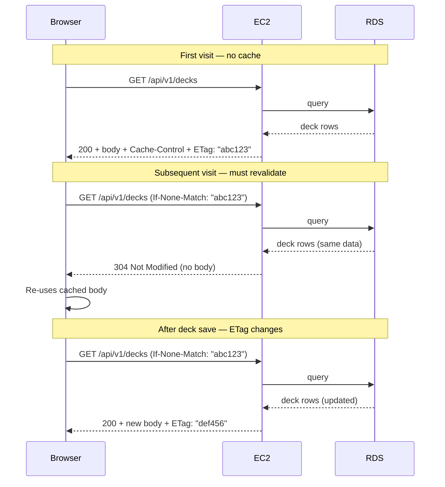

# HTTP Caching — GET /api/v1/decks

## Overview

The deck list API response (`GET /api/v1/decks`) uses **`Vary: Cookie`**, **`Cache-Control: private, max-age=0, must-revalidate`**, and **`ETag`** so clients always revalidate with the server while still allowing **304 Not Modified** when nothing changed.

**File:** `src/api/http/decks.http.ts` (`GET /api/v1/decks`)

---

## Headers

### `Vary: Cookie`

Tells the browser to include the session cookie value in the cache key. Without this, a guest auto-login session and a real user session could share the same cached response for `GET /api/v1/decks`.

### `Cache-Control: private, max-age=0, must-revalidate`

- `private` — cached only in the user's own browser. Never stored by a shared proxy or CDN. Correct because each user's deck list is unique.
- `max-age=0, must-revalidate` — the response is **not** treated as fresh without contacting the server. Each use triggers a **network revalidation** (typically with `If-None-Match`). This avoids serving a **stale deck list** (e.g. old `is_valid` / legality) after saves, which happened when the list used `max-age=30` (browser could serve cached JSON for 30 seconds with no round-trip).

### `ETag: "<sha1-hash>"`

A SHA-1 fingerprint of the serialised **v1** response body (`{"data":...,"meta":{},"errors":[]}`), computed on every request.

On revalidation, the browser sends the stored ETag in `If-None-Match`. The server:

- Runs the database query and transforms the result as normal
- Computes the ETag of the new response
- Compares to the `If-None-Match` value
  - **Match:** returns `304 Not Modified` with **no body** — browser re-uses its local copy
  - **No match:** returns `200` with the new body and an updated ETag

---

## Request Flow

---

## Implementation Notes

- The ETag is computed with Node's built-in `crypto` module — no external dependency.
- The full response body is serialised to JSON once and reused for both the ETag hash and the response write, avoiding double-serialisation.
- Cache invalidation is automatic: any change to the user's deck list produces a different ETag on the next request.
- This cache is **per-user** (the `private` directive) and complements the server-side in-memory cache in `PostgreSQLDeckRepository` (2-minute TTL). The two layers work independently.
